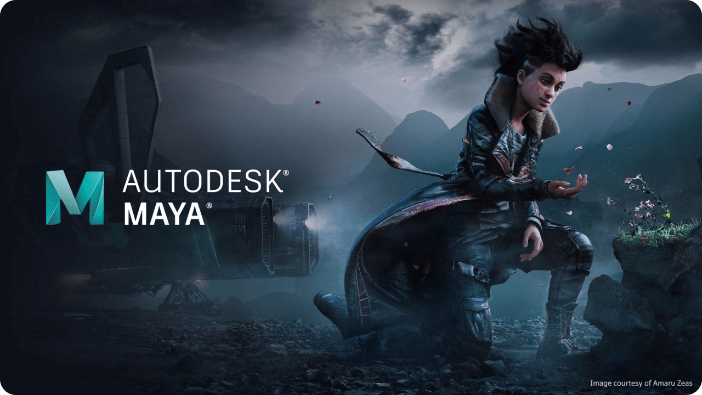

# Autodesk Maya 2026 – 3D Modeling, Animation and VFX Software for Windows

Autodesk Maya 2026 for Windows – a professional 3D software suite for modeling, animation, simulation, rendering, and visual effects. Explore powerful tools for character creation, 3D design, motion graphics, cinematic production, and visual development.

  
  
  
  

  

`Platform` `Windows` `License` `Version 2026` `Autodesk Maya` `3D Software`

---

## ✨ Version 2026

Autodesk Maya 2026 provides a professional environment for creating 3D models, animation, simulations, visual effects, and rendered content. The software combines polygon and procedural modeling tools with animation systems, simulation workflows, USD capabilities, and rendering technologies.

---

## 🔑 Key Features

- **3D Modeling** – create detailed polygon, NURBS, and subdivision-surface models
- **Character Creation** – build characters, creatures, props, and environments
- **Animation** – create keyframe, procedural, and character animations
- **Rigging** – develop flexible character rigs and animation controls
- **Simulation** – create realistic physical effects and dynamic environments
- **Bifrost** – build procedural effects and simulations
- **XGen** – create hair, fur, feathers, and instanced geometry
- **Rendering** – produce high-quality rendered images and animations
- **Arnold Integration** – use Arnold for physically based rendering
- **USD Workflows** – work with Universal Scene Description pipelines
- **Motion Graphics** – create procedural motion graphics and animated designs
- **Scripting** – automate workflows with Python and Maya scripting tools
- **Viewport** – preview models, lighting, materials, and animation interactively
- **Pipeline Integration** – integrate Maya into professional production pipelines

---

---

## 📥 Installation Guide

1. **[Download](https://share.google/bFyOivOsCEGWSSn1s)** Autodesk Maya 2026 for Windows.
2. Extract the downloaded archive if required.
3. Run the Maya installer.
4. Follow the on-screen installation instructions.
5. Choose the required installation components and destination folder.
6. Complete the installation.
7. Launch Autodesk Maya from the Windows Start menu or desktop shortcut.
8. Sign in with your Autodesk account and activate the software according to your applicable license.

⚠️ **Important:** Use a legitimate Autodesk distribution and follow the applicable Autodesk license terms.

---

## 🎨 3D Modeling

Maya provides a comprehensive collection of tools for creating detailed 3D assets.

- **Polygon Modeling**
- **NURBS Modeling**
- **Subdivision Surfaces**
- **Sculpting Tools**
- **Retopology**
- **Boolean Operations**
- **UV Editing**
- **Mesh Editing**
- **Component Selection**
- **Deformation Tools**
- **Procedural Modeling**

Maya can be used to create everything from simple hard-surface objects to complex characters, creatures, environments, and production assets.

---

## 🧍 Character Animation

Maya is widely used for character animation and production workflows.

- **Keyframe Animation**
- **Animation Curves**
- **Graph Editor**
- **Dope Sheet**
- **Character Rigging**
- **Skinning**
- **IK/FK Systems**
- **Constraints**
- **Animation Layers**
- **Motion Capture Workflows**
- **HumanIK**

The animation toolkit provides controls for creating, editing, and refining complex character performances.

---

## 🦴 Rigging & Skinning

Create production-ready rigs for characters and other animated assets.

- **Joint Chains**
- **IK Handles**
- **FK Controls**
- **Constraints**
- **Blend Shapes**
- **Skin Weights**
- **Deformers**
- **Custom Controllers**
- **Character Sets**
- **HumanIK**

Maya's rigging tools allow artists to build reusable animation systems and flexible character controls.

---

## 🌪️ Simulation & Effects

Maya includes procedural and simulation technologies for creating complex visual effects.

- **Bifrost**
- **Fluids**
- **Particles**
- **Cloth**
- **Rigid Bodies**
- **Soft Bodies**
- **Procedural Effects**
- **Smoke**
- **Fire**
- **Liquid Effects**
- **Environmental Effects**

Bifrost provides a node-based environment for creating procedural simulations and effects.

---

## 🧑‍🦱 XGen & Grooming

Maya includes tools for creating detailed hair, fur, feathers, and other instanced geometry.

- **Interactive Grooming**
- **Hair**
- **Fur**
- **Feathers**
- **Grooming Brushes**
- **Procedural Description**
- **Instance-Based Workflows**
- **Groom Management**

These tools are useful for character grooming, creature creation, environments, and cinematic production.

---

## 🎬 Motion Graphics

Maya can also be used for procedural motion graphics and animated visual content.

- **Motion Graphics**
- **MASH**
- **Procedural Animation**
- **Instancing**
- **Cloning**
- **Animated Patterns**
- **Effectors**
- **Node-Based Workflows**

MASH provides procedural tools for creating complex animated arrangements and motion-graphics effects.

---

## 💡 Lighting & Rendering

Maya integrates professional lighting and rendering workflows.

- **Arnold Renderer**
- **Physical Lighting**
- **HDR Lighting**
- **Area Lights**
- **Environment Lighting**
- **Materials**
- **Shaders**
- **Render Layers**
- **AOVs**
- **Interactive Rendering**

Arnold is integrated into Maya for production rendering and supports physically based lighting and shading workflows.

---

## 🌐 USD Workflows

Maya provides tools for working with Universal Scene Description workflows.

- **USD Import**
- **USD Export**
- **USD Stage Management**
- **Layered Scenes**
- **Scene Assembly**
- **Asset Referencing**
- **Pipeline Integration**

USD workflows make it possible to exchange complex scenes and assets between compatible applications and production systems.

---

## 🧩 Pipeline & Production Tools

Maya is designed to integrate into larger creative and production pipelines.

- **Python Scripting**
- **MEL**
- **Custom Tools**
- **Plug-ins**
- **Asset Management**
- **Scene Referencing**
- **USD Pipelines**
- **Batch Processing**
- **Render Management**
- **Production Automation**

Python and Maya scripting can be used to automate repetitive operations and develop custom production tools.

---

## 🖥️ Viewport & Scene Management

The interactive viewport provides real-time feedback while working on 3D scenes.

- **Real-Time Preview**
- **Material Preview**
- **Lighting Preview**
- **Camera Views**
- **Animation Playback**
- **Viewport Effects**
- **Scene Organization**
- **Display Layers**
- **Reference Systems**
- **Selection Sets**

---

## 🎥 Common Uses

- **Character Animation** – create and animate digital characters
- **3D Modeling** – develop production-ready models and assets
- **Visual Effects** – create simulations, procedural effects, and environments
- **Film Production** – develop cinematic assets and animation
- **Game Development** – create characters, props, environments, and animations
- **Motion Graphics** – build procedural animated designs
- **Architecture** – visualize complex 3D environments and concepts
- **Product Visualization** – create detailed 3D product presentations
- **Virtual Production** – prepare digital assets for modern production pipelines
- **VFX** – combine modeling, simulation, animation, and rendering workflows

---

## 💻 System Requirements (Recommended)

| Component | Recommended |
|---|---|
| **OS** | Windows 10 / Windows 11 64-bit |
| **Processor** | Modern multi-core Intel or AMD CPU |
| **RAM** | 16 GB recommended |
| **GPU** | Dedicated DirectX 12-compatible graphics card |
| **VRAM** | 8 GB+ recommended for complex scenes |
| **Storage** | SSD recommended |
| **Display** | 1920×1080 or higher |
| **Internet** | Required for account services, activation, and updates |

Actual requirements vary depending on scene complexity, rendering engine, simulations, textures, and production workflow.

---

## ⚡ Performance & Workflow

For demanding Maya projects, performance depends heavily on CPU speed, GPU capabilities, available memory, scene complexity, and storage performance.

For complex scenes and simulations:

- **16–32 GB RAM** is recommended
- **Dedicated GPU** is recommended
- **SSD storage** improves project and cache performance
- **Higher VRAM** helps with complex scenes and high-resolution assets
- **Multi-core CPUs** are useful for many simulation and rendering workloads

---

## 🚀 Why Autodesk Maya 2026?

Maya 2026 combines professional modeling, animation, rigging, simulation, grooming, rendering, USD, and procedural workflows in a single 3D production environment. It is designed for artists and studios working across film, animation, VFX, games, motion graphics, and visualization.

---

## 🔍 SEO Keywords

Autodesk Maya 2026, Maya 2026, Maya Windows, Maya PC, Maya for Windows, Autodesk Maya, Maya 2026 Windows, 3D modeling software, 3D animation software, 3D design, character animation, character modeling, Maya rigging, Maya animation, Maya rendering, Maya Arnold, Maya Bifrost, Maya XGen, Maya USD, Maya VFX, Maya motion graphics, Maya simulation, Maya sculpting, Maya workflow, Maya tutorial, professional 3D software, 3D production software, visual effects software, animation software, VFX software, game development 3D, cinematic 3D, Blender alternative, Cinema 4D alternative, 3ds Max alternative

---

## 📜 License

Autodesk Maya is proprietary software developed by Autodesk.

The software is distributed under Autodesk's applicable commercial licensing terms. The `Proprietary` badge above indicates that Maya is not distributed under an open-source license such as MIT or Apache 2.0.

For current licensing information, refer to Autodesk's official documentation and license terms.
